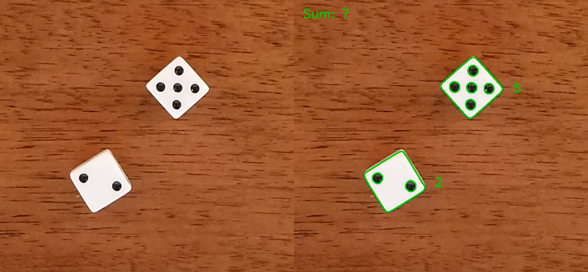

# Dice Dots Counter
 **Dice Dots Counter** is a program written in **C++** using **OpenCV library** to count the number of dots when dice is tossed. It reads the image and uses **SimpleBlobDetector** from OpenCV library to detect the circular dots present in dice.
 
<p align="center">
  
</p>
 
 # How TO Use
 This program was written using **OpenCV 2.4.9** so I hope it works with 2.4.* version of OpenCV. Follow the below instructions to avoid confusion.
 - **Clone/Download** the repository.
 - **cd** to the cloned directory.
 - **Compile** the source file.
 ```sh
		$ cmake .
		$ make
```
- Pass the **test image** to the resulting **exe** file (_countdots_) to view the result.
```sh
	$ ./countdots dice1.png
	$ ./countdots dice2.png
	$ ./countdots dice3.png
	...
```
# Future Enhancements
- Some code needs to be added to display the dots count for every single dice.
